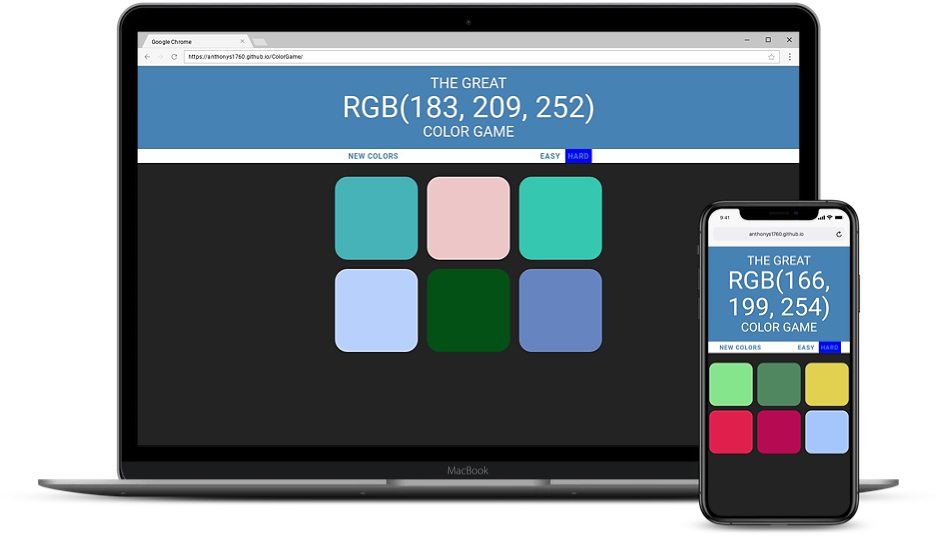

# Color Game

Hello!

Test your knowledge of RGB color codes. Look at the number above, and guess which square matches the RGB code.

## [View Live Site](https://anthonys1760.github.io/ColorGame/)

(Hint: Remember the first number indicates the amount of RED, the second number indicates the amount of GREEN, and the third number indicates the amount of BLUE.)
